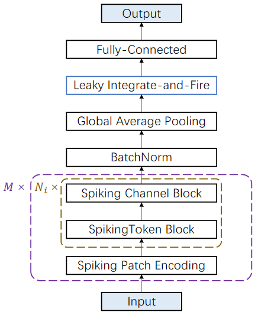
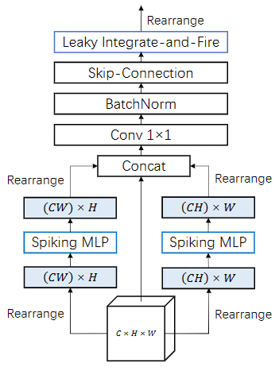
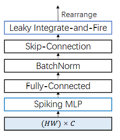
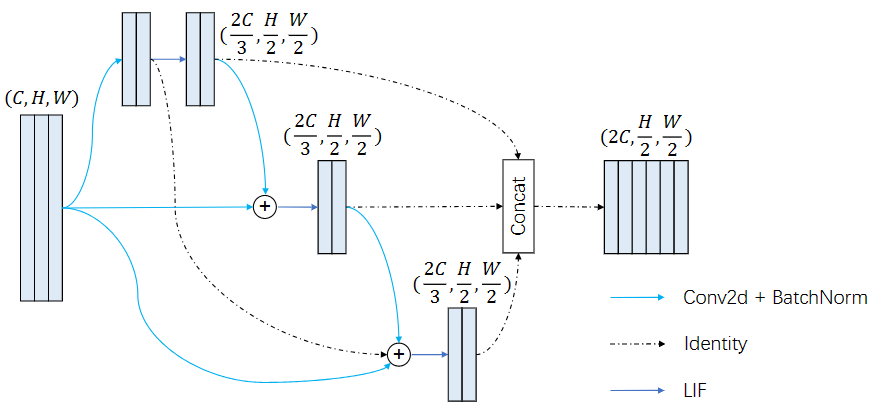

# Efficient Deep Spiking Multi-Layer Perceptrons with Multiplication-Free Inference

```BibTex
@misc{li2024efficient,
      title={Efficient Deep Spiking Multi-Layer Perceptrons with Multiplication-Free Inference}, 
      author={Boyan Li and Luziwei Leng and Ran Cheng and Shuaijie Shen and Kaixuan Zhang and Jianguo Zhang and Jianxing Liao},
      year={2024},
      eprint={2306.12465},
      archivePrefix={arXiv},
      primaryClass={cs.NE}
}
```

## Overview
Overall |  Spiking Token Block | Spiking Channel Block | Spiking Patch Encoding
:-------------------------:|:-------------------------:|:-------------------------:|:-------------------------:
</img> | </img> | </img> | </img> 

This project provides the official implementation for our TNNLS2023 paper "[Efficient Deep Spiking Multi-Layer Perceptrons with Multiplication-Free Inference](https://arxiv.org/abs/2306.12465)". **Mixer-SNN** is a spiking MLP architecture that uses batch normalization to retain MFI compatibility and introduces a spiking patch encoding layer to reinforce local feature extraction capabilities. Our network secures a top-1 accuracy of **66.39%** on the ImageNet-1K dataset, surpassing the directly trained spiking ResNet-34 by **2.67%**. An expanded version of our network compares with the performance of the spiking VGG-16 network with a **71.64%** top-1 accuracy, all while operating with a model capacity **2.1 times smaller**.

## Installation

```
git clone https://github.com/BugMaker-Boyan/Mixer-SNN.git
cd Mixer-SNN
conda create -n mixer_snn python=3.9
conda activate mixer_snn
pip install -r requirements.txt
```

Additionally, install cupy package **based on yout cuda version**.

```
# For CUDA 11.2 ~ 11.x
pip install cupy-cuda11x

# For CUDA 12.x
pip install cupy-cuda12x
```

## Training

To train a Mixer-SNN-Small model on ImageNet-1K dataset with 8 GPUs, run:

```bash
CUDA_VISIBLE_DEVICES=0,1,2,3,4,5,6,7 python -m torch.distributed.launch \
	--nproc_per_node=8 train.py \
	--model_size small
	--T 4 \
	--cupy \
	--amp \
	--batch-size 64 \
	--model mixer_sparse \
	--epochs 100 \
	--output-dir ./logs \
	--lr 0.1 \
	--lr-scheduler cosa \
	--data imagenet \
	--data-path /data/ILSVRC2012 \
	--opt sgd \
	--lr-warmup-epochs 0 \
	--exp-name Mixer-SNN-Small-ImageNet
```

To train a Mixer-SNN-Small model on CIFAR10 dataset with 8 GPUs, run:

```bash
CUDA_VISIBLE_DEVICES=0,1,2,3,4,5,6,7 python -m torch.distributed.launch \
	--nproc_per_node=8 train.py \
	--model_size small
	--T 4 \
	--cupy \
	--amp \
	--batch-size 64 \
	--model mixer_sparse \
	--epochs 100 \
	--output-dir ./logs \
	--lr 0.1 \
	--lr-scheduler cosa \
	--data cifar10 \
	--data-path /data/liboyan/ILSVRC2012 \
	--opt sgd \
	--lr-warmup-epochs 0 \
	--exp-name Mixer-SNN-Small-ImageNet
```

You can watch the training process via tensorboard:

```bash
tensorboadr --logdir=./logs
```

## Results

### ImageNet-1K

| Method                                                       | Architecture       | Model Size | T     | Accuracy[%] |
| ------------------------------------------------------------ | ------------------ | ---------- | ----- | ----------- |
| [ANN-SNN](https://arxiv.org/abs/1802.02627)                  | ResNet-34          | 22M        | 768   | 71.6        |
| [ANN-SNN](https://arxiv.org/abs/1802.02627)                  | VGG-16             | 138M       | 2500  | 69.96       |
| [S-ResNet](https://ieeexplore.ieee.org/document/9597475)     | ResNet-50          | 26M        | 350   | 73.77       |
| [Hybrid training](https://openreview.net/forum?id=B1xSperKvH) | ResNet-34          | 22M        | 250   | 61.48       |
| [Hybrid training](https://www.semanticscholar.org/paper/Enabling-Spike-Based-Backpropagation-for-Training-Lee-Sarwar/eaaaed86d1b811fb4690e20ec532d4298c10e324) | VGG-16             | 138M       | 250   | 65.19       |
| [Tandem Learning](https://ieeexplore.ieee.org/document/9492305) | AlexNet            | 62M        | 10    | 50.22       |
| [STBP-tdBN](https://ojs.aaai.org/index.php/AAAI/article/view/17320) | ResNet-34          | 22M        | 6     | 63.72       |
| [TET](https://openreview.net/forum?id=_XNtisL32jv)           | ResNet-34          | 22M        | 6     | 64.79       |
| [STBP-tdBN](https://ojs.aaai.org/index.php/AAAI/article/view/17320) | ResNet-34-large    | 86M        | 6     | 67.05       |
| [Diet-SNN](https://ieeexplore.ieee.org/document/9556508/)    | VGG-16             | 138M       | 5     | 69.00       |
| [SpikeDHS](https://papers.nips.cc/paper_files/paper/2022/hash/9e8c2895db691eaab85af37bddee75aa-Abstract-Conference.html) | SpikeDHS-CLA-large | 58M        | 6     | 67.96       |
| **Spiking MLP (our model)**                                  | **MLP-SPE-T**      | **25M**    | **4** | **66.39**   |
| **Spiking MLP (our model)**                                  | **MLP-SPE-T**      | **25M**    | **6** | **69.09**   |
| **Spiking MLP (our model)**                                  | **MLP-S**          | **34M**    | **4** | **63.25**   |
| **Spiking MLP (our model)**                                  | **MLP-SPE-S**      | **38M**    | **4** | **68.84**   |
| **Spiking MLP (our model)**                                  | **MLP-SPE-B**      | **66M**    | **6** | **71.64**   |